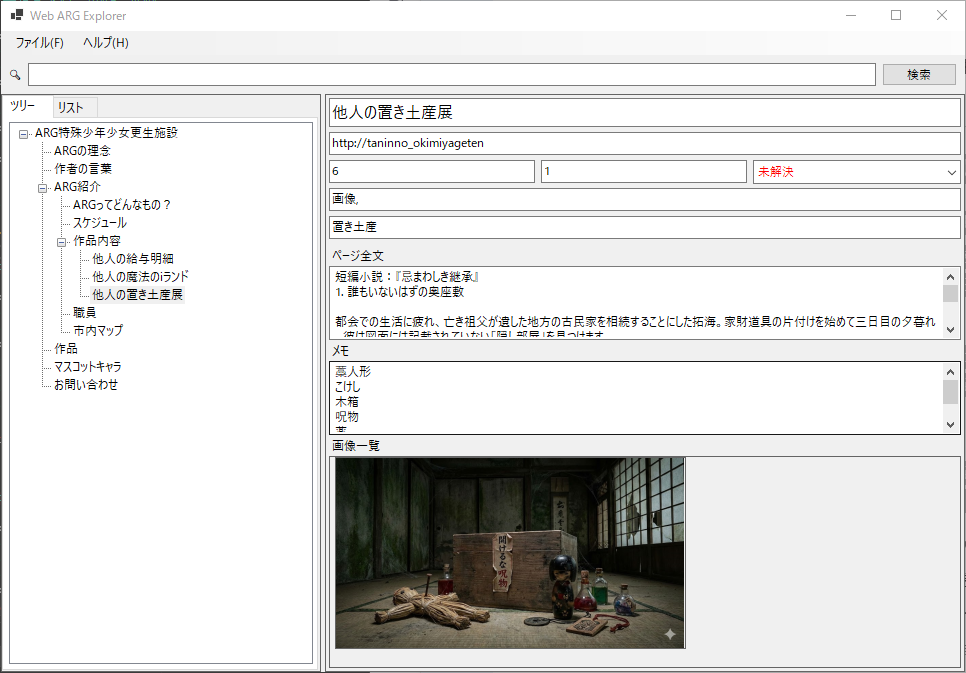

# Web ARG Explorer v1.0.4

## 概要

Web ARG Explorerは、Web探索型ARG（代替現実ゲーム）の情報を整理・管理するためのデスクトップアプリケーションです。
発見したWebページ、手がかり、進捗状況を記録し、情報追跡を支援します。

---

## 変更履歴

### v1.0.4

 - URLを入力するとタイトルが自動入力される処理を追加

### v1.0.3

 - ページリストを右クリック時に、コンテキストメニュー [URLを開く] が表示される機能を追加
 - ページリストをダブルクリック時にブラウザでURLが開く機能を追加

### v1.0.2

 - ツリービューを常に展開するよう修正
 - ノードを同一親上にドロップした際にノードが消える不具合を修正

### v1.0.1

 - 問い合わせフォームの追加

### v1.0.0

 - 新規作成

## 主な機能

* ページ情報の構造化: URL、ページ全文、レベル、ステータス、タグなど、詳細な情報を保存します。
* 階層構造の管理: ページ間の遷移をツリー構造で表示し、ドラッグ＆ドロップで階層を編集できます。
* ページのリスト化: ページを番号順にリスト表示し、抜けているページを一目で確認できます。
* 横断検索: URL、タイトル、ページ全文、タグ、検索ワードを対象とした全文検索機能を提供します。
* データエクスポート: 全ページのデータ単一のJSONファイルとしてエクスポートします。

---

## 操作方法

### 基本の流れ

1. 右クリックを押下し、任意の階層にページを追加して、URLやメモ（ページ全文 / 手がかり）を登録します。
2. 必要に応じて画像やレベル、ステータス、タグを設定して整理します。
3. ページ間の関係をツリーで管理し、探索の流れを可視化します。
4. ページ一覧をリストで確認し、探索漏れがないか確認します。

### 階層（ツリー）の操作

- 親子関係の変更: ツリー上でドラッグ＆ドロップしてページの階層を移動します。
- 探索経路の整理: 分岐や行き止まりをノードとして残し、後から見返せる形に整理します。

### 検索

- URL / タイトル / 本文 (ページ全文) / タグ / 検索ワードを対象に横断検索できます。

### データエクスポート

- メニュー等からエクスポートを実行すると、全ページのデータが単一のJSONファイルとして出力されます。
- 共有やバックアップ用途に利用できます。

### 画像の登録・閲覧・削除

- 画像を追加する（ファイル選択）
  - 「画像一覧」上で右クリックし、[画像を追加する] を選択します。
  - 対応形式: ".jpg" / ".jpeg" / ".png"
- 画像を追加する（ドラッグ&ドロップ）
  - エクスプローラー等から画像ファイルを「画像一覧」へドラッグ&ドロップします。
  - ページが未選択の場合は追加できません。
- 画像を開く
  - サムネイルをダブルクリック、または右クリックして [画像を開く]を選択します。
- 画像を削除する
  - サムネイルを右クリックして [画像を削除する]を選択します。

### 右クリック（コンテキストメニュー）

本アプリの右クリックメニューは、右クリックした場所（ツリー/ページリスト/画像一覧/画像サムネイル）に応じて内容が切り替わります。

#### ツリー（ページ）を右クリックした場合

- ルートノード右クリック時
  - [子階層にページを追加]
  - [URLを開く]
- ルート以外のノード右クリック時
  - [同階層にページを追加]
  - [子階層にページを追加]
  - [ページを削除]
  - [URLを開く]

#### リスト（ページ）を右クリックした場合

- ノード右クリック時
  -[URLを開く]

#### 画像一覧を右クリックした場合

- 画像サムネイル上で右クリック
  - [画像を開く]
  - [画像を追加する]
  - [画像を削除する]
- 画像一覧の空白で右クリック
  - [画像を追加する]
  

補足:
- ツリー上のページはダブルクリックでも [URLを開く] と同様にブラウザで開きます。
- ツリーの空白を右クリックした場合は、ルートノード扱いのメニューになります。
- リスト上のページはダブルクリックでも [URLを開く] と同様にブラウザで開きます。
- サムネイルはダブルクリックでも [画像を開く] と同様に別ウィンドウで画像が開きます。